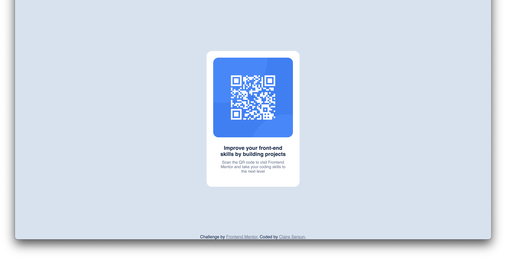
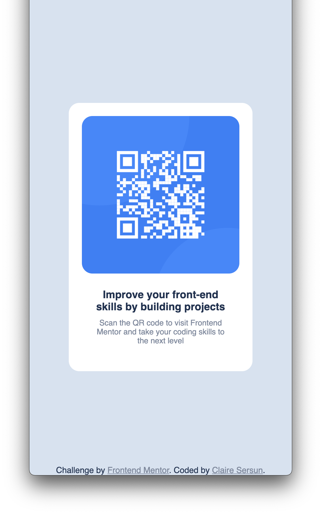

# Frontend Mentor - QR code component solution

This is a solution to the [QR code component challenge on Frontend Mentor](https://www.frontendmentor.io/challenges/qr-code-component-iux_sIO_H). Frontend Mentor challenges help you improve your coding skills by building realistic projects. 

## Table of contents

- [Overview](#overview)
  - [Screenshot](#screenshot)
  - [Links](#links)
- [My process](#my-process)
  - [Built with](#built-with)
  - [What I learned](#what-i-learned)
- [Author](#author)

## Overview

### Screenshot



### Links

- Solution URL: [https://github.com/clairesersun/QR-code-component-challenge-from-frontend-mentor](https://github.com/clairesersun/QR-code-component-challenge-from-frontend-mentorm)
- Live Site URL: [https://clairesersun.github.io/QR-code-component-challenge-from-frontend-mentor/](https://clairesersun.github.io/QR-code-component-challenge-from-frontend-mentor/)

## My process
I built this challenge up from an Semantic HTML5 markup base and layered in styling. Last, I formated the layout and ensured that it responded well when altering screen display sizes.

### Built with

- Semantic HTML5 markup
- CSS custom properties
- CSS Grid
- Mobile-first workflow
### What I learned

I worked on centering items on the screen vertically and horizotally:

```css
dialog {
    background-color: hsl(0, 0%, 100%);
    border-radius: 20px;
    width: 350px;
    margin: auto;
    top: 50%;
    bottom: 50%;
}
```

I also figured out the centering of a footer:
```css
footer {
    text-align: center;
    color: hsl(218, 44%, 22%);
    left: 0;
    bottom: 0;
    width: 100%;
    position: fixed;
}
```
## Author

- Website - [Claire Sersun](https://www.clairesersun.com/)
- Frontend Mentor - [@clairesersun](https://www.frontendmentor.io/profile/clairesersun)
- LinkedIn - [Claire Sersun](https://www.linkedin.com/in/clairesersun/)